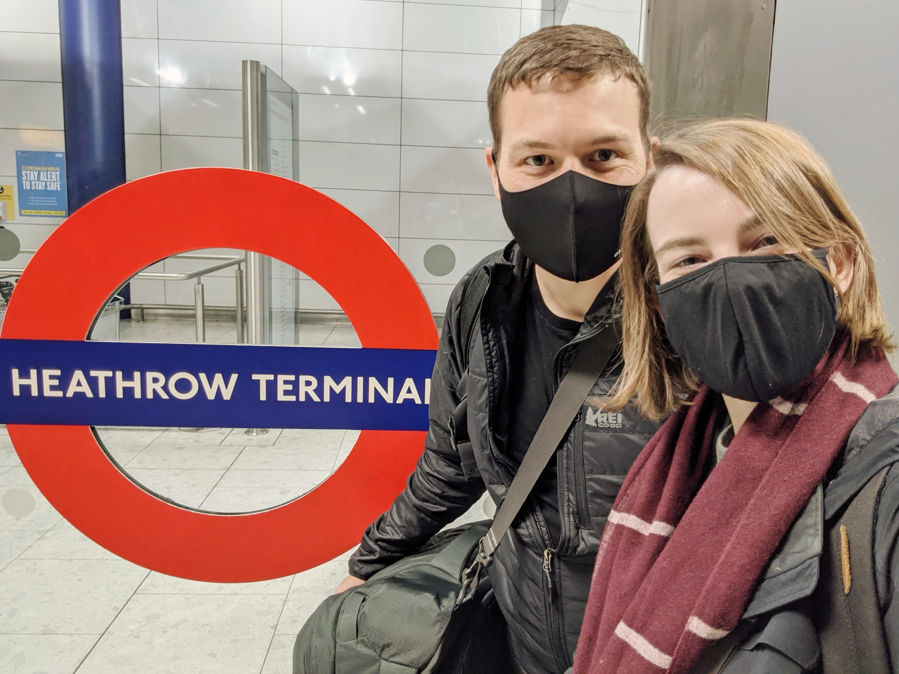
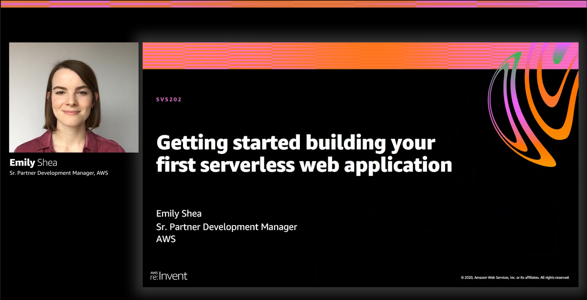

I'm so excited to share one of the projects that's kept me busy over the last few months - moving from Seattle to London for a new role at AWS!

I've been planning and working on this since last January, and believe me, it seemed a lot less crazy back then! It took a lot of work and patience, but [Robert](https://twitter.com/rsyvarth) and I finally arrived yesterday.

(maxwidth=500px)
 
En route to London

For the last 2.5 years, I've been Partner Development Manager for Serverless ISVs. It's been an incredible start to my time at AWS. I've gotten to know so many great people working on serverless at AWS and at AWS Partners ([cool things](https://twitter.com/em__shea/status/1255246227635081217?s=20) [we did together](https://twitter.com/dhruvsood/status/1326942977952948224?s=20) [this year](https://twitter.com/em__shea/status/1333831735901995009?s=20)).

While my new role will be focused more on customers rather than partners, I'm glad to be sticking with serverless and this awesome community!

(maxwidth=500px)
 
Serverless Conf 2019

At the same time, I've also been busy with my own software development projects as a hobby. I've had a lot of fun learning to code and building my own apps, and there's plenty more I'd like to keep improving on.

In 2020, I launched [auto generated vocab quizzes](https://twitter.com/em__shea/status/1316043747377905665?s=20) for my daily Chinese vocabulary web app, [Haohaotiantian](https://haohaotiantian.com/). I spent time throughout the year building my front-end development skills to build this feature with confidence. I'm really pleased with how it turned out!

I was thrilled to get an opportunity at this past year's re:Invent to give a talk on how I learned serverless while building Haohaotiantian ([talk recording](https://virtual.awsevents.com/media/Getting+started+building+your+first+serverless+web+application/1_honkgmpt), [resources](https://serverlessland.com/reinvent2020/svs202)). By far the highlight for me was hearing that the talk was helpful to people who are new to serverless. It's given me lots of motivation to keep building and learning in public.

(maxwidth=500px)
 
Slide from my re:Invent 2020 talk

All in all, I'm feeling grateful to have a lot of positives to look back on in 2020.

My new role is Sr. Business Development Manager for Serverless in the UK and Ireland. I'm so excited about the team I'll be a part of, getting to work with more serverless customers, and of course getting to (eventually) explore London!

I hope this new year gives you a fresh start and renewed energy and optimism for whatever 2021 throws at us!

\- Emily

🇬🇧
