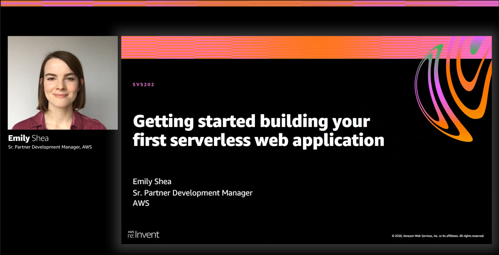

The first half of this year I kept up on my goal of writing roughly a blog post per month, but in the second half I got busy with a few big projects. One of those projects I'm sharing about today - I'm changing roles at AWS and moving from Seattle to London! 

I've been Partner Development Manager for serverless ISVs for the last 2.5 years. It's been an incredible start to my time at AWS and working in cloud technology. I've gotten to know so many great people working on serverless at AWS and at AWS Partners (cool things we did together this year). While I'm going to be working primarily with customers rather than partners in my new role, I'm glad to not be going far from a technology perspective!

- OCI https://twitter.com/em__shea/status/1333831735901995009?s=20
- extensions https://twitter.com/dhruvsood/status/1326942977952948224?s=20
- SRP https://twitter.com/em__shea/status/1255246227635081217?s=20

If you follow my blog or Twitter, you'll know that I've also been busy in my free time getting into software development projects. I've had a lot of fun learning to code and build my own apps, and there's plenty more that I'd like to build and skills I'd like to improve. In 2020, I launched [auto generated vocab quizzes](https://twitter.com/em__shea/status/1316043747377905665?s=20) for my daily Chinese vocabulary web app, Haohaotiantian. I spent time throughout the year building my front-end development skills in order to launch the feature. I got an opportunity at this past year's re:Invent to give a talk on how I learned serverless while building the Chinese vocab app ([talk recording](https://virtual.awsevents.com/media/Getting+started+building+your+first+serverless+web+application/1_honkgmpt), [resources](https://serverlessland.com/reinvent2020/svs202)). I loved getting to hear from so mnay people who are new to serverless that the talk was helpful to them. It's given me lots of motivation to keep building and learning in public.

All in all, I'm feeling grateful to have a lot of positives to look back on in an otherwise tough year.

The new role that I'm starting this year is Sr. Business Development Manager for Serverless in the UK and Ireland. I'm so excited about the team I'll be working with, getting to work with serverless customers, and of course getting to (eventually) explore London! My goal for the past few years has been to find the right opportunity to move abroad again. 

- Promotion
- Launched HHTT vocab quizzes, worked hard on learning front-end development

Happy New Year

##### Jump to:

- Section 1
- Section 2

---

### Section 1

Body

---

Relevant links

:uk: